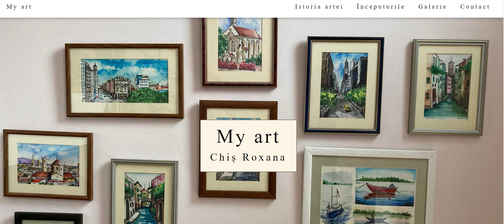
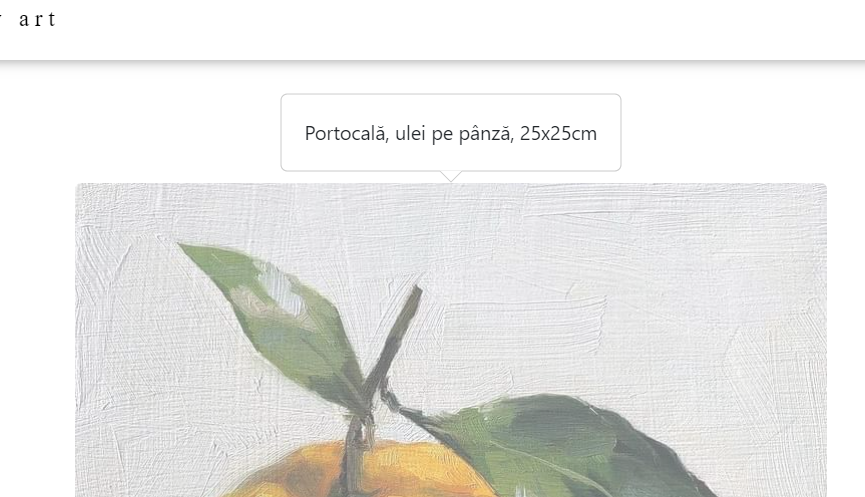
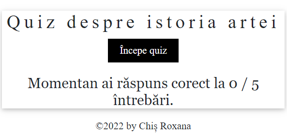
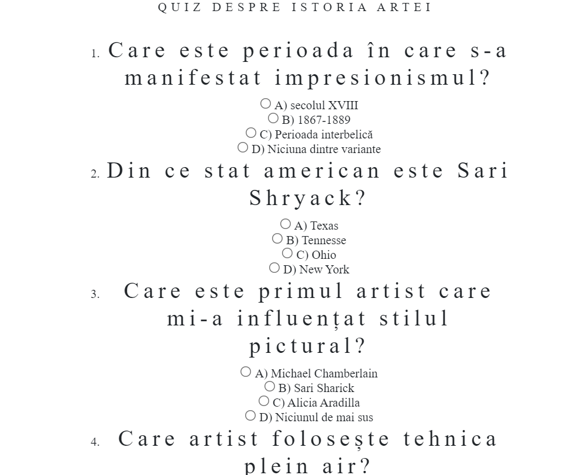
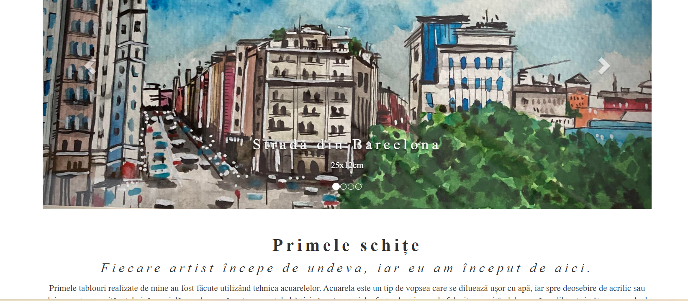
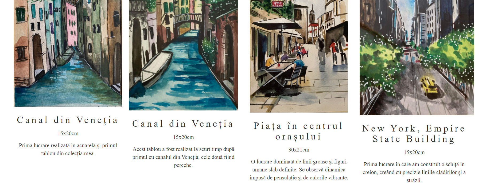
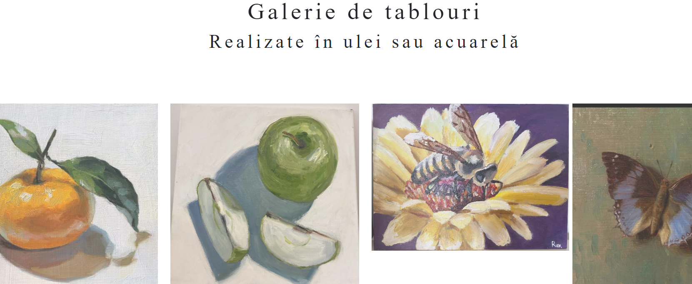

# MyArt
This website is a personal project, created for presenting all my recent paintings. It was designed to group my art in one place and to define a passion that before I considered just a hobby. The first page, entitled "My Art", captures details about my hobby, a photo of some of my paintings and, moreover, allows the user to access the other sections. 

  

The entire site was designed to highlight my artworks, therefore, by simply placing the mouse on one of the pictures, details about the painting appear, its dimensions in centimeters and the material used to make them, as well as the title of the work. Furthermore, when the user clicks on a picture, it is enlarged for better viewing.

  

On "History", the second page, I have presented in a few frames two of the painting styles that have influenced my art over the years, Impressionism and Romanticism, and I have specified three artists who taught me techniques and inspired me. I have also created a quiz from the information provided on this page, and at the end of the quiz, the answers appear on the main page.

  
   

On the page entitled "Beginnings" I described the first technique I used and presented my first works.

On the fourth page, I have created a gallery of paintings, and each painting can be viewed in its entirety by clicking on the image. The last page contains contact details.

## Technologies used
* HTML
* CSS
* JavaScript
